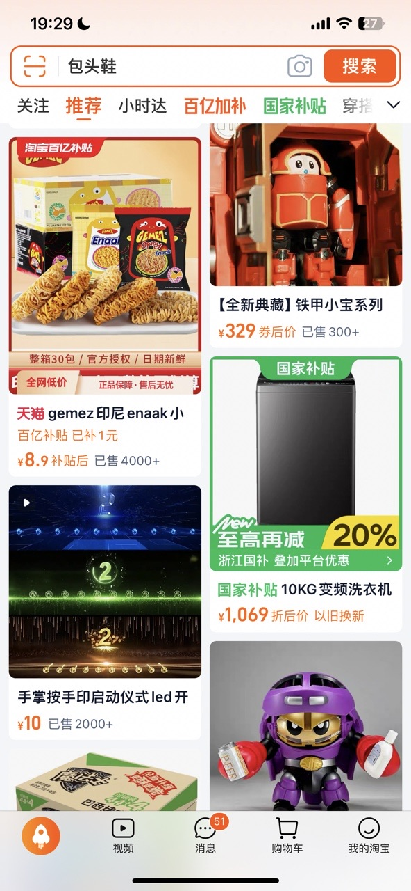

<p align="center">
  
</p>


<h1 align="center">ImageCli</h1>
<div align="center">
    A natural language described, out of the box 📷 image command line tools. 🔧
</div>


<div align="center">

[English](./README.md) | [简体中文](./README_ZH.md)

</div>


## Overview
ImageCli is a simple command-line interface designed to effectively handle image operations, allowing users to perform basic tasks through simple descriptive commands (without the need to understand complex tool design, speak freely)


## Download
```shell 
pip install open-image-cli
`````

## Examples

### 1. Image size
```bash
img size -f '/Users/youngfreefjs/Downloads/logo.png'

>> Image Pixels Size: 1024x1024
```

### 2. Image file size
```bash
img file-size -f '/Users/youngfreefjs/Downloads/logo.png'

>> Image File Size: 496470.00 bytes
```
Specify Return Unit  
You can also specify the output unit for the file size (e.g. bytes, KB, MB):
```bash
img file-size -f '/Users/youngfreefjs/Downloads/logo.png' -u MB

>> Image File Size: 0.47 MB
```

### 3. Compress image file size
```bash
img compress -f '/Users/youngfreefjs/Downloads/logo.png' -t 0.1 -u MB

>> Compressed image saved to: /Users/youngfreefjs/Downloads/compressed_logo.png
>> Compressed Image Size: 0.09 MB
```


### 4. Change Photo background color
```bash
img background -f '/Users/youngfreefjs/Desktop/code/github/imagecli/static/passport_photo_blue.png' -c 'RED' 

>> Image resolution: 1536x1024, Channels: 3
>> Modified image background `red` saved to: /Users/youngfreefjs/Desktop/code/github/imagecli/static/background_RED_passport_photo_blue.png
```
| Original Background Photo        | RED Background Photo         | WHITE Background Photo        |
|-----------------------|------------------------------|-------------------------------|
|  |  |  |


### 5. Merge images to a long image
> Code by: my former company [`@Meituan-Dianping`](https://github.com/Meituan-Dianping/vision-ui/blob/master/resources/vision_merge.md)


> Please ensure that after taking the first screenshot, scroll 1/3 before taking the second screenshot.
You can manually take screenshots (slide up from 2/3 of the screen height to 1/3)
Alternatively, screenshots can be taken through UI automation, with a screen height ranging from 2/3 to 1/3

```bash
img merge -i '/Users/youngfreefjs/Desktop/code/github/imagecli/static/image_merge/taobaoPage1.JPG' -i '/Users/youngfreefjs/Desktop/code/github/imagecli/static/image_merge/taobaoPage2.JPG' -i '/Users/youngfreefjs/Desktop/code/github/imagecli/static/image_merge/taobaoPage3.JPG' -o '/Users/youngfreefjs/Desktop/code/github/imagecli/static/image_merge/merged.png'


>> Merged image saved to: /Users/youngfreefjs/Desktop/code/github/imagecli/static/image_merge/merged.png
```
| Original Images        | Page1 Images        | Page2 Images        | Page3 Image         |
|-----------------------|-----------------------|-----------------------|-----------------------|
|  |  | |  |


### 6. OCR (current version macOS only)
```bash
img ocr -f '/Users/youngfreefjs/Desktop/code/github/imagecli/static/image_merge/taobaoPage720P.JPG'

>> [
      {
          "content": "19:29",
          "leftTopX": 42.00000074999997,
          "leftTopY": 23.999999724999952,
          "width": 71.5,
          "height": 22.00000000000003,
          "tags": {
              "confidence": 0.5
          }
      },

      ...
  ]
```
| Image                                                   | OCR result                                                                                                                                                                                                                                                                                                                                                                                                                                                                                           |
|--------------------------------------------------------|-----------------------------------------------------------------------------------------------------------------------------------------------------------------------------------------------------------------------------------------------------------------------------------------------------------------------------------------------------------------------------------------------------------------------------------------------------------------------------------------------------|
|  | ```[{"content":"19:29","leftTopX":42.00000074999997,"leftTopY":23.999999724999952,"width":71.5,"height":22.00000000000003,"tags":{"confidence":0.5}},{"content":"关注","leftTopX":23.999999700000004,"leftTopY":140.00000010000008,"width":48,"height":24.000000000000057,"tags":{"confidence":1}},{"content":"包头鞋","leftTopX":98.00000044999999,"leftTopY":81.99999991250002,"width":72,"height":26.000000000000085,"tags":{"confidence":1}},{"content":"推荐","leftTopX":92.00000025454545,"leftTopY":137.99999990000015,"width":56,"height":30,"tags":{"confidence":1}},{"content":"我的淘宝","leftTopX":499.9375748301192,"leftTopY":1211.7545823228884,"width":62.1248512268066,"height":16.490835189819393,"tags":{"confidence":1}}]```
 |